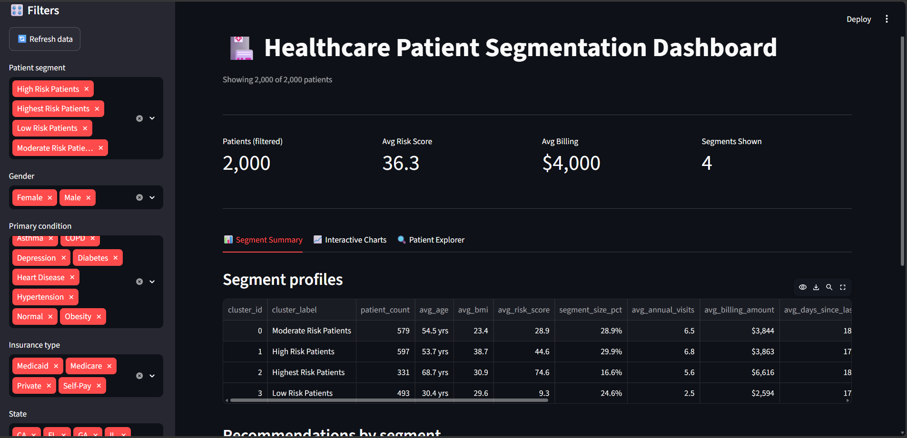
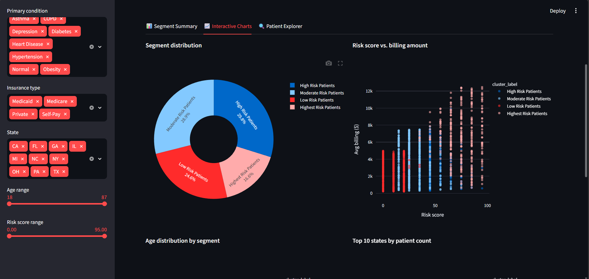
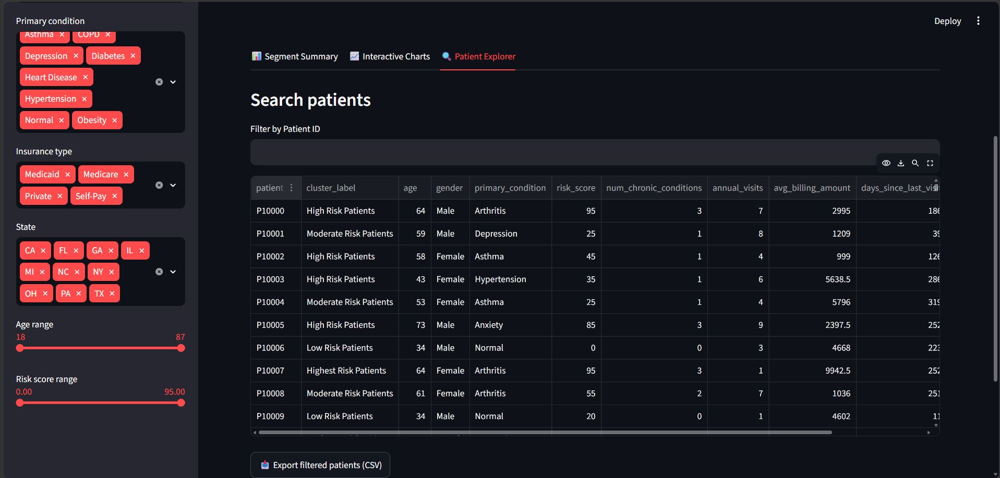

# 🏥 Healthcare Patient Segmentation using Machine Learning


A complete end-to-end healthcare patient segmentation project built with **Python, MySQL, scikit-learn, SQLAlchemy, Plotly, and Streamlit**.

The project segments patients based on demographics, healthcare utilization, chronic conditions, billing patterns, and preventive care behavior using **K-Means clustering**. Results are stored in MySQL and explored through an interactive Streamlit dashboard.

---

## 📌 Project Objectives

- Understand patient behavior across demographics and utilization patterns
- Identify high-risk patients before costs escalate
- Support targeted preventive care and outreach programs
- Give non-technical stakeholders a readable summary, not just a model

---

## 🚀 Features

- Full pipeline: validation → cleaning → feature engineering → preprocessing → clustering → interpretation → storage
- K-Means clustering with elbow method + silhouette score analysis
- MySQL storage with a proper two-table schema (foreign key, constraints, indexes, a summary view)
- Interactive Streamlit dashboard (Plotly charts, live filtering, patient search, CSV export)
- Every pipeline stage has defensive error handling — a bad file, a dropped DB connection, or missing data shows a clear message instead of crashing
- A written business recommendations report, in plain language, for non-technical readers

---

## 🛠 Technologies Used

| Category | Technology |
|---|---|
| Language | Python 3.11 |
| Database | MySQL |
| ORM / DB access | SQLAlchemy, mysql-connector-python |
| Data processing | pandas, NumPy |
| Machine learning | scikit-learn (KMeans, StandardScaler, silhouette score) |
| Model persistence | joblib |
| EDA visualization | matplotlib, seaborn (notebook) |
| Dashboard visualization | Plotly (interactive) |
| Dashboard | Streamlit |
| Config | python-dotenv |

---

## 📂 Project Structure

```text
healthcare-patient-segmentation/
│
├── data/
│   ├── raw/
│   │   └── patient_segmentation_dataset.csv
│   └── processed/
│       ├── patients_cleaned.csv
│       ├── patients_features.csv
│       ├── patients_processed.csv
│       ├── patients_clustered.csv
│       ├── patients_final.csv
│       └── cluster_profiles.csv
│
├── sql/
│   └── schema.sql
│
├── notebooks/
│   └── 01_eda_and_clustering.ipynb
│
├── src/
│   ├── database.py                # MySQL connection only
│   ├── data_validation.py
│   ├── data_cleaning.py
│   ├── feature_engineering.py
│   ├── preprocessing.py
│   ├── clustering.py
│   ├── cluster_interpretation.py
│   ├── load_to_database.py        # inserts into MySQL, FK-safe order
│   └── pipeline.py                # orchestrates all of the above
│
├── models/
│   ├── kmeans_model.pkl
│   └── scaler.pkl
│
├── dashboard/
│   ├── Dashboard_1.png
│   ├── Dashboard_2.png
│   └── Dashboard_3.png
│
├── reports/
│   ├── cluster_chart.png
│   └── business_recommendations.md
│
├── requirements.txt
├── .env
├── README.md
├── app.py
└── run_pipeline.py
```

> **Note on `src/__init__.py`:** it's intentionally not there. Every module in
> `src/` is imported directly (e.g. `from database import get_engine`) with
> the folder added to `sys.path`, rather than as a `src.module` package
> import. `__init__.py` is only needed if you import things as
> `from src.database import get_engine` — this project doesn't, so it's safe
> to leave out. If you later refactor to proper package imports, add an empty
> `__init__.py` back in.

---

## ⚙ Project Workflow

```
Raw Dataset
      │
      ▼
Data Validation        (schema + range checks against the MySQL constraints)
      │
      ▼
Data Cleaning           (dedupe, fill missing values, align to DB column names)
      │
      ▼
Feature Engineering      (risk score, BMI category, cost per visit)
      │
      ▼
Preprocessing            (one-hot encoding + StandardScaler)
      │
      ▼
K-Means Clustering       (elbow method + silhouette score → k=4)
      │
      ▼
Cluster Interpretation   (profile each segment, rank-based risk labels)
      │
      ▼
Store Results in MySQL   (atomic transaction, FK-safe insert order)
      │
      ▼
Interactive Streamlit Dashboard
```

---

## 🗄 Database Design

Two tables, linked by a foreign key, plus a summary view.

**`patients_clustered`** — one row per patient: demographics, health
metrics, billing, risk score, and assigned `cluster_id`.

**`cluster_profiles`** — one row per segment: label, patient count, averages
across every key metric, dominant condition/insurance, and a written
recommendation. `patients_clustered.cluster_id` is a foreign key into this
table.

**`patient_segment_summary`** — a view joining both tables for quick
aggregate queries.

Full definitions, constraints, and indexes are in [`sql/schema.sql`](sql/schema.sql).

---

## 🤖 Machine Learning

**Algorithm:** K-Means clustering

**Pipeline:** feature selection → one-hot encoding → standard scaling →
elbow method + silhouette score across k=2–10 → final fit at k=4 → rank-based
labeling by average risk score.

**Why k=4 instead of the statistical "best" k:** silhouette scores are modest
across every k tested (roughly 0.13–0.18, never higher) — this dataset's
patients vary more like a continuum than in sharply separated groups, which
is common for demographic/behavioral data without engineered ground-truth
clusters. In flat cases like this, low k almost always wins on silhouette
score somewhat by default, regardless of whether it's useful. k=4 was chosen
because it produces four genuinely distinguishable, actionable patient
segments rather than a mathematically marginal 2–3 vague groups. This
reasoning — and the full elbow/silhouette chart — is worked through in
[`notebooks/01_eda_and_clustering.ipynb`](notebooks/01_eda_and_clustering.ipynb).

**Generated segments**, ranked by average risk score:

| Segment | Patients | Avg age | Avg risk score | Avg billing/yr |
|---|---|---|---|---|
| Highest Risk Patients | 331 | 68.7 | 74.6 | $6,616 |
| High Risk Patients | 597 | 53.7 | 44.6 | $3,863 |
| Moderate Risk Patients | 579 | 54.6 | 28.9 | $3,844 |
| Low Risk Patients | 493 | 30.4 | 9.3 | $2,594 |

---

## 📊 Dashboard

The Streamlit dashboard has three sections.

### 1️⃣ Segment Summary
- KPIs: patients (filtered), average risk score, average billing, segments shown
- Full segment profile table (age, BMI, risk score, visits, billing, dominant condition/insurance)
- Expandable recommendation card per segment

### 2️⃣ Interactive Charts
- Segment distribution (donut chart)
- Risk score vs. billing amount (scatter, colored by segment, hoverable)
- Age distribution by segment (histogram)
- Top 10 states by patient count (stacked bar)

### 3️⃣ Patient Explorer
- Search by Patient ID
- Auto-generated patient detail card when a search narrows to one result
- Export filtered results to CSV

**Filters available (sidebar):** patient segment, gender, primary condition,
insurance type, state, age range, risk score range.

**Screenshots:**


*Segment Summary — KPIs and segment profile table*


*Interactive Charts — segment distribution and risk vs. billing scatter*


*Patient Explorer — searchable, exportable patient table*

---

## 📈 Business Insights

A full plain-language write-up, with real numbers for each segment and
concrete recommended actions, is in
[`reports/business_recommendations.md`](reports/business_recommendations.md).

Short version:

- **Highest Risk Patients** (331, 16.6%) — oldest, most expensive segment. Prioritize care management and early intervention.
- **High Risk Patients** (597, 29.9%) — largest segment, highest BMI, still young enough for prevention to pay off. Target weight management and hypertension monitoring.
- **Moderate Risk Patients** (579, 29.0%) — healthy BMI but similar age to High Risk. Routine preventive care is enough to keep them from drifting upward.
- **Low Risk Patients** (493, 24.6%) — youngest, healthiest, cheapest. Standard reminders only.

---

## ▶ Running the Project

### Clone the repository

```bash
git clone https://github.com/yourusername/healthcare-patient-segmentation.git
cd healthcare-patient-segmentation
```

### Install dependencies

```bash
pip install -r requirements.txt
```

### Set up the database

Run the schema in MySQL Workbench or the CLI:

```bash
mysql -u root -p < sql/schema.sql
```

### Configure environment variables

Create a `.env` file in the project root. **Use these exact variable names** —
`src/database.py` reads these specific names, not the more conventional
`DB_HOST`/`DB_NAME` style:

```env
MySQL_HOST=localhost
MySQL_USER=root
MySQL_PASSWORD=your_password
My_DB=healthcare_DB
```

### Run the full pipeline

```bash
python run_pipeline.py
```

This validates, cleans, engineers features, scales, clusters, interprets,
and loads everything into MySQL — one command, ends with exit code 0 on
success.

### Launch the dashboard

```bash
streamlit run app.py
```

---

## 📓 Notebook

[`notebooks/01_eda_and_clustering.ipynb`](notebooks/01_eda_and_clustering.ipynb)
walks through the exploratory analysis and clustering logic step by step —
distributions, correlations, the missing-value finding, the elbow/silhouette
chart, and a PCA visualization of the final clusters — with the reasoning
behind each modeling decision explained inline. The production pipeline in
`src/` is the hardened, error-handled version of the same logic; the notebook
is the "why" behind it.

---

## 📊 Future Enhancements

- Predict segment assignment for new/incoming patients without refitting
- Compare K-Means against DBSCAN or hierarchical clustering
- Patient-level risk trajectory prediction over time
- REST API for programmatic access to segment assignments
- Docker Compose setup (app + MySQL) for one-command local deployment

---

## 👨‍💻 Author

**Mahesh**

Healthcare Patient Segmentation Project — built with Python, machine learning, SQL, and Streamlit.

---

⭐ If you found this project useful, consider giving it a star.
